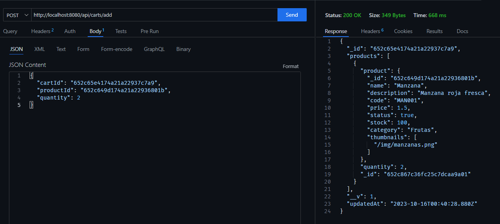

# My E-Commerce API

Este es un proyecto para gestionar un comercio electrónico. Utiliza Node.js, Express y MongoDB para crear una API que permite realizar operaciones CRUD en productos, carros de compra y mensajes.

## Requisitos previos

- Node.js (versión 14 o superior)
- MongoDB

## Instalación

1. Clona este repositorio en tu máquina local, luego ingresa al directorio del proyecto: practica-integradora-1

```bash
git clone https://github.com/Primo18/coderhouse-backend
cd coderhouse-backend
cd practica-integradora-1
```

1. Instala las dependencias del proyecto:

```bash
npm install
```

## Uso

1. Inicia el servidor:

```bash
npm run dev
```

2. Abre el navegador en la dirección http://localhost:8080
3. Puedes usar herramientas como Postman para realizar peticiones HTTP a la API.


  

## Ejemplos de uso de la API con cURL

### /api/carts

* **GET**: Get all carts

```bash
curl -X GET http://localhost:8080/api/carts
```


* **POST**: Create a new cart

```bash
curl -X POST http://localhost:8080/api/carts
```


### /api/carts/:id

* **GET**: Get a cart by its ID

```bash
curl -X GET http://localhost:8080/api/carts/:id
```


### /api/carts/add

* **POST**: Add a product to a cart

```bash
curl -X POST http://localhost:8080/api/carts/add
```



### /api/messages

* **GET**: Get all messages

```bash
curl -X GET http://localhost:8080/api/messages
```


* **POST**: Add a new message

```bash
curl -X POST http://localhost:8080/api/messages
```

### /api/messages/:user

* **GET**: Get messages by user

```bash
curl -X GET http://localhost:8080/api/messages/:user
```

### /api/products

* **GET**: Get all products

```bash
curl -X GET http://localhost:8080/api/products
```


* **POST**: Add a new product

```bash
curl -X POST http://localhost:8080/api/products
```

### /api/products/:id

* **GET**: Get a product by its ID

```bash
curl -X GET http://localhost:8080/api/products/:id
```

* **PUT**: Update a product by its ID

```bash
curl -X PUT http://localhost:8080/api/products/:id
```

* **DELETE**: Delete a product by its ID

```bash
curl -X DELETE http://localhost:8080/api/products/:id
```

### /

* **GET**: Render the home page

```bash
curl -X GET http://localhost:8080/
```

### /realtimeproducts

* **GET**: Render the real-time products page

```bash
curl -X GET http://localhost:8080/realtimeproducts
```

### /chat

* **GET**: Render the chat page

```bash
curl -X GET http://localhost:8080/chat
```

## Scripts

- `npm start`: Inicia el servidor utilizando nodemon.
- `npm test`: Ejecuta los test (aún no implementado).

## Endpoints de la API

| Método | Ruta                | Descripción                        |
| ------ | ------------------- | ---------------------------------- |
| GET    | /api/carts          | Get all carts                      |
| POST   | /api/carts          | Create a new cart                  |
| GET    | /api/carts/:id      | Get a cart by its ID               |
| POST   | /api/carts/add      | Add a product to a cart            |
| POST   | /api/carts/remove   | Remove a product from a cart       |
| GET    | /api/messages       | Get all messages                   |
| POST   | /api/messages       | Add a new message                  |
| GET    | /api/messages/:user | Get messages by user               |
| GET    | /api/products       | Get all products                   |
| POST   | /api/products       | Add a new product                  |
| GET    | /api/products/:id   | Get a product by its ID            |
| PUT    | /api/products/:id   | Update a product by its ID         |
| DELETE | /api/products/:id   | Delete a product by its ID         |
| GET    | /                   | Render the home page               |
| GET    | /realtimeproducts   | Render the real-time products page |
| GET    | /chat               | Render the chat page               |


